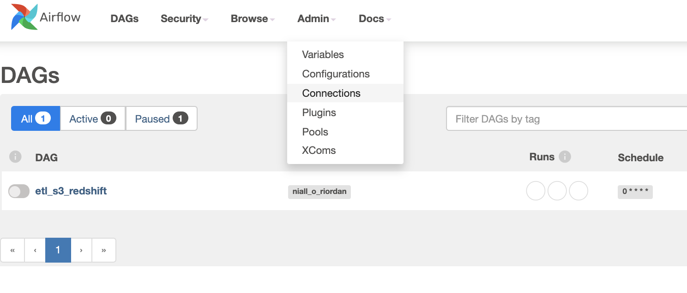
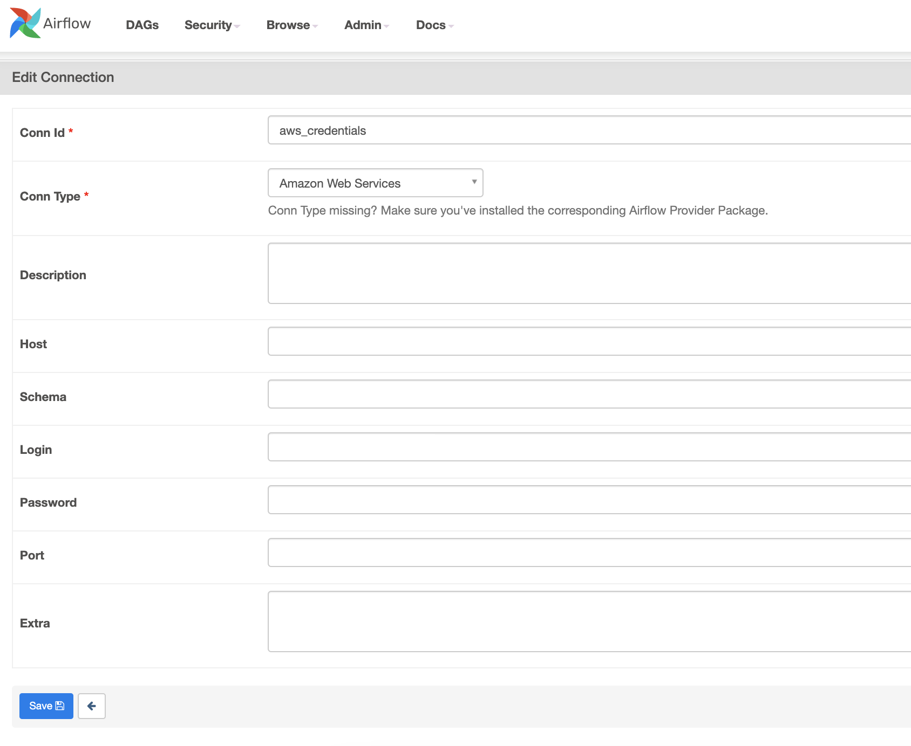
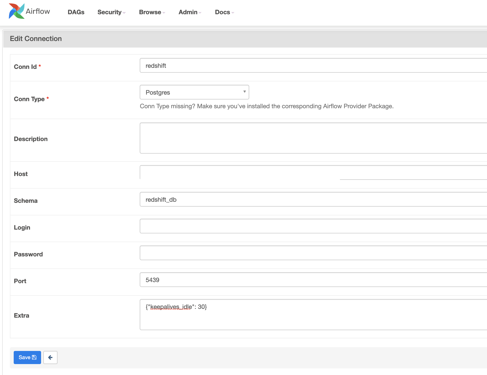
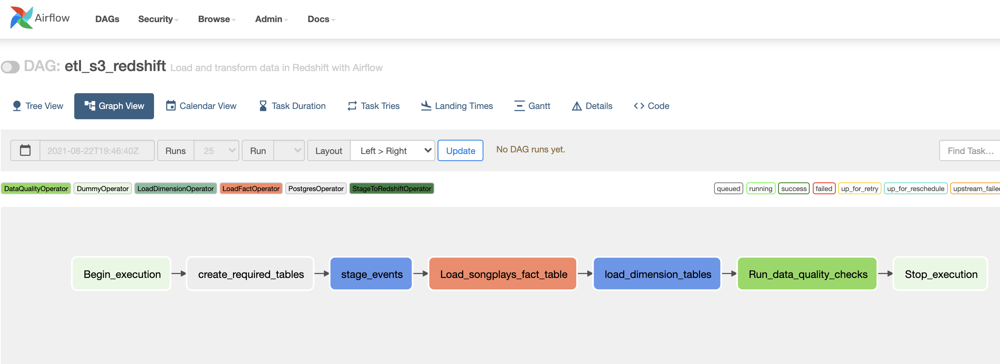
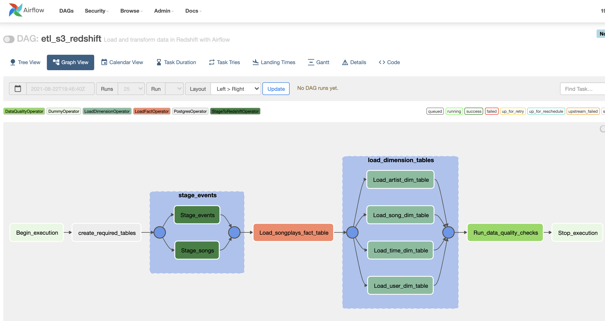

# Airflow Redshift Pipeline <!-- omit in toc -->

    
Table of Contents

- [Overview](#overview)
- [Quick Start](#quick-start)
  - [Initialise Airflow](#initialise-airflow)
  - [Create Redshift Cluster](#create-redshift-cluster)
  - [Airflow Connections](#airflow-connections)
    - [AWS Credentials](#aws-credentials)
    - [Redshift Cluster](#redshift-cluster)
  - [Airflow DAG](#airflow-dag)
- [Structure](#structure)

## Overview

The purpose of this overview is to provide an ETL pipeline in Redshift that is orchestrated and scheduled via Airflow 2.0

## Quick Start
### Initialise Airflow

Follow the guidelines in [Airflow-Docker](https://github.com/nialloriordan/airflow-docker) repository to initialise Airflow 2.0.

### Create Redshift Cluster

Follow the guidelines in [terraform-redshift-cluster](https://github.com/nialloriordan/terraform-redshift-cluster) repository to create the Redshift Cluster via Terraform.
   
Note: 
- Take note of the `redshift_cluster_dns` that will be outputted once the Redshift Cluster is created as this will be required for Airflow
- Don't forget to kill the cluster once finished, by running `terraform destroy`

### Airflow Connections

    
 Show/Hide Details

In order for Airflow to connect to run the ETL pipeline, you will need to provide your AWS credentials and details for connecting to the Redshift cluster.

Open the Airflow UI view the Connections tab:

#### AWS Credentials

Create a new connection with the following details:

- **Conn Id**: Enter aws_credentials.
- **Conn Type**: Enter Amazon Web Services.
- **Login**: Enter your Access key ID from your IAM User credentials.
- **Password**: Enter your Secret access key from your IAM User credentials.

#### Redshift Cluster

Create a new connection with the following details:

- Conn Id: Enter redshift.
- Conn Type: Enter Postgres.
- Host: Enter the endpoint of your Redshift cluster, that was outputted after creating your Redshift cluster.
- Schema: Enter the redshift schema created when launching the Redshift Cluster. This is the Redshift database you want to connect to.
- Login: Enter your username you created when launching your Redshift cluster.
- Password: Enter the password you created when launching your Redshift cluster.
- Port: Enter the port you created when launching your Redshift cluster e.g. 5439.
- Extra: `{"keepalives_idle":30}` as per [Postgres Hook Documentation](https://airflow.apache.org/docs/apache-airflow-providers-postgres/stable/_api/airflow/providers/postgres/hooks/postgres/index.html) this should be set to a value less than 300 to prevent issues with long running SQL queries.

### Airflow DAG

    
 Show/Hide Details

This DAG consists of five main tasks:
1. Create Tables
2. Stage Event Tables
3. Load Fact Table
4. Load Dimension Tables
5. Run Data Quality Checks

Tasks for staging event tables and loading dimension tables makes use of Airflow 2.0's Task Group feature to organise tasks within the DAG's graph view in the Airflow 2.0 UI.

## Structure

    
 Show/Hide Details

- [docker-compose.yaml](docker-compose.yaml): build Airflow services
- [dags](dags/): folder for airflow dags
- [logs/](logs/): (included in .gitignore) folder for airflow logs
- [plugins/](plugins/): folder for airflow plugins
  - [helpers/](plugins/helpers/): helper functions for Airflow
  - [operators/](plugins/operators/): Custom Airflow operators
- [airflow.sh](airflow.sh): convenient bash file to run Airflow CLI commands
- [airflow.cfg](config/airflow.cfg): airflow config file
- [images/](images/): images for [README](README.md)
- [terraform-redshift-cluster](terraform-redshift-cluster) terraform redshift submodule

